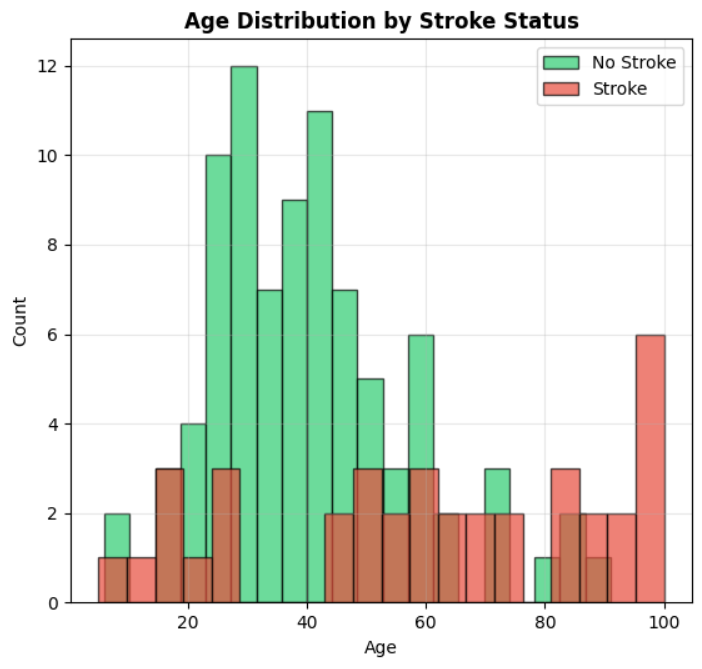
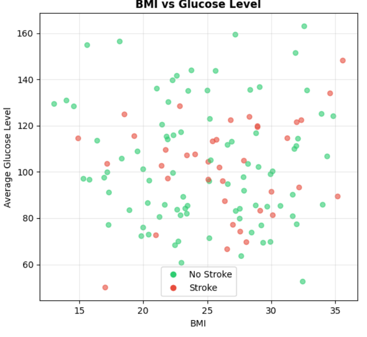
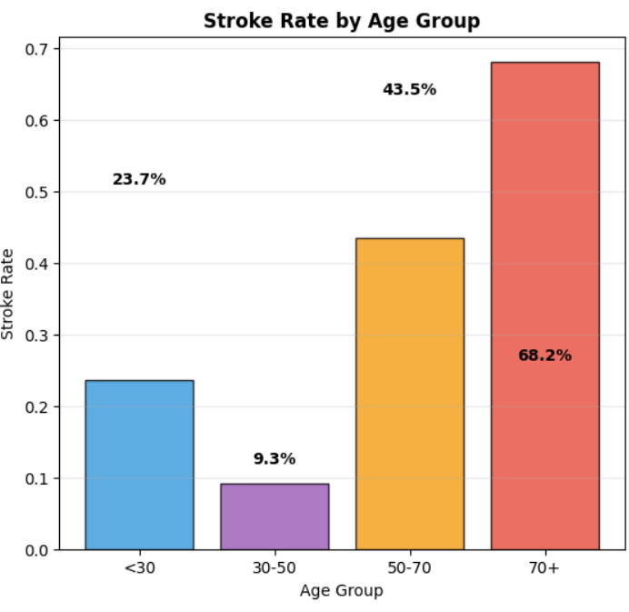

# Stroke Risk Prediction using Machine Learning

## Project Overview
This project implements an end-to-end machine learning pipeline to predict stroke risk using demographic, clinical, and lifestyle data.  
The objective is to support early risk identification by estimating individual stroke probability and stratifying patients into clinically meaningful risk groups.

The pipeline follows best practices for medical machine learning, including statistical validation, feature engineering, class imbalance handling, and rigorous model evaluation.

---

## Problem Statement
Stroke is a leading cause of morbidity and mortality worldwide.  
Early identification of high-risk individuals enables preventive intervention.

**Goal:**  
Predict whether a patient is at risk of stroke and estimate their probability of stroke occurrence.

**Task Type:**  
Binary classification (Stroke vs No Stroke)

---

## Dataset Description
- Total samples: **126**
- Target variable: `stroke`
- Stroke prevalence: **30.2%**
- Features:
  - Demographic: age, gender, marital status, residence type
  - Clinical: hypertension, heart disease, BMI, glucose level
  - Lifestyle: smoking status, work type
- Missing values: **None**

---

## Exploratory & Statistical Analysis
To ensure feature relevance and reduce noise, statistical hypothesis testing was performed:

- Significant predictors (p < 0.05):
  - Age
  - Hypertension
  - Heart disease
  - Ever married
- Non-significant variables were retained selectively when beneficial for non-linear models.

This step grounds feature selection in statistical evidence rather than model-only heuristics.

---
## 📊 Exploratory Data Analysis & Visual Insights

The following visualizations were generated using Python to explore key risk
factors associated with stroke occurrence and support data-driven conclusions.

### Age Distribution by Stroke Status

> Stroke prevalence increases significantly with age, highlighting age as a
primary risk factor.

### BMI and Glucose Level Analysis

> Elevated glucose levels show a stronger association with stroke risk than BMI
alone, indicating metabolic health as a critical factor.

### Stroke Rate by Key Risk Factors

> Hypertension, heart disease, and smoking status substantially increase stroke
likelihood.

### Stroke Rate by Age Group

> Stroke incidence rises sharply in older age groups, reinforcing the importance
of early intervention and monitoring.

---

## Feature Engineering
The original 12 features were expanded to **25 engineered features**, including:

- Polynomial features (e.g. age²)
- Log and square-root transformations
- Interaction terms (e.g. BMI × glucose)
- Age group categorization

Feature importance analysis confirmed that engineered age-related features were among the strongest predictors.

---

## Data Preprocessing
- Train/Test split performed **before** resampling to prevent data leakage
- Categorical encoding and feature scaling applied
- Class imbalance handled using **SMOTE** on training data only

Class distribution:
- Training (before SMOTE): 70 No Stroke / 30 Stroke
- Training (after SMOTE): 70 No Stroke / 70 Stroke

---

## Model Training & Comparison
Multiple models were evaluated using cross-validation and test-set performance:

- Logistic Regression
- Random Forest
- Extra Trees
- Gradient Boosting
- Support Vector Machine
- K-Nearest Neighbors
- Gaussian Naive Bayes

### Best Performing Models
| Model          | CV ROC-AUC | Test ROC-AUC |
|---------------|-----------|--------------|
| Random Forest | 0.96      | **0.91**     |
| Extra Trees   | 0.94      | 0.90         |

Tree-based ensemble models outperformed linear models due to strong non-linear relationships in the data.

---

## Final Model Performance
**Selected Model:** Random Forest

- Accuracy: 0.81
- Balanced Accuracy: 0.70
- ROC-AUC: **0.91**
- Precision (Stroke): 1.00
- Recall (Stroke): 0.40
- F1-score (Stroke): 0.57

Confusion Matrix:
[[22 0]
[6 4]]

# The model demonstrates strong discrimination ability while maintaining high precision for stroke prediction.

---

## Risk Stratification
Predicted probabilities were converted into clinically interpretable risk categories:

- Low Risk (< 30%)
- Medium Risk (30–50%)
- High Risk (50–70%)
- Very High Risk (≥ 70%)

Observed stroke rates increased monotonically across risk groups, supporting real-world usability for triage and monitoring.

---

## Model Calibration
Calibration analysis shows reasonable alignment between predicted probabilities and observed stroke rates, particularly in higher-risk bins, supporting probabilistic decision-making.

---

## Key Insights
- Age and hypertension are the most influential predictors
- Feature engineering significantly improves performance
- Class imbalance handling is critical in medical datasets
- ROC-AUC is a more reliable metric than accuracy for this problem

---

## Limitations
- Small dataset size limits generalization
- Moderate recall for stroke cases
- External validation required before clinical deployment

---

## Tools & Technologies
- Python
- pandas, NumPy
- scikit-learn
- imbalanced-learn
- matplotlib, seaborn

---

## Disclaimer
This project is for educational and research purposes only.  
It is not intended for clinical decision-making without proper validation and regulatory approval.

